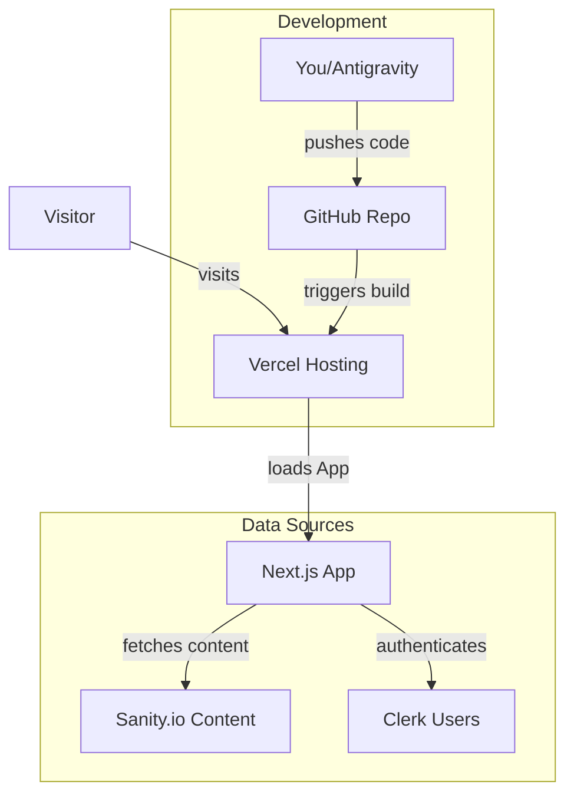

# Lab Website Universal - Comprehensive User Guide

This guide covers everything you need to know to manage, deploy, and update your lab website.


## 1. Initial Setup & Hosting
**Setting up this website for the first time? Follow this sequence.**

### Step 1: GitHub (The Code)
1.  **Repository**: Ensure this code exists in a GitHub repository (e.g., `your-username/lab-website`).
2.  **Private vs Public**: Private is recommended to keep your configuration scripts safe, though the site itself will be public.

### Step 2: Sanity.io (The Content Backend)
1.  **Create Project**: Log in to sanity.io and create a new project.
2.  **Get ID**: Copy your `ProjectId` and `Dataset` name.
3.  **Add CORS**: In Sanity project settings > API > CORS Origins, add your future Vercel URL (e.g., `https://your-lab.vercel.app`) to allow the website to talk to Sanity.

### Step 3: Clerk (The User Backend)
1.  **Create Application**: Log in to Clerk.com and create a new application.
2.  **Get Keys**: Copy your `NEXT_PUBLIC_CLERK_PUBLISHABLE_KEY` and `CLERK_SECRET_KEY`.

### Step 4: Vercel (The Host)
1.  **Import Project**: Log in to Vercel, click "Add New", and select your GitHub repository.
2.  **Environment Variables**: Before clicking "Deploy", add these variables (found in your `.env.local` or from previous steps):
    *   `NEXT_PUBLIC_SANITY_PROJECT_ID`
    *   `NEXT_PUBLIC_SANITY_DATASET`
    *   `NEXT_PUBLIC_CLERK_PUBLISHABLE_KEY`
    *   `CLERK_SECRET_KEY`
    *   `EMAIL_USER` & `EMAIL_PASS` (for backups)
3.  **Deploy**: Click Deploy. Vercel will build the site and give you a live URL.

### Step 5: Connect Custom Domain
If you purchased a domain (e.g., `mylab.com`) from GoDaddy, Namecheap, etc.:
1.  **Vercel Settings**: Go to your Vercel Project > Settings > Domains.
2.  **Add Domain**: Type your domain (e.g., `mylab.com`) and click Add.
3.  **DNS Configuration**: Vercel will show you DNS records (usually an **A Record** or **CNAME**).
4.  **Registrar**: Log in to where you bought your domain (GoDaddy, etc.), find "DNS Management", and add the records Vercel provided.
5.  **Verify**: It may take minutes to hours. verified, Vercel will issue an SSL certificate automatically.

---

## 2. Architecture & Data Flow
**How the pieces talk to each other.**



1.  **GitHub -> Vercel**: You push code to GitHub. Vercel sees the change, builds the new site, and publishes it.
2.  **Sanity -> Website**: The website fetches text/images from Sanity. When you edit Sanity, the content updates on the site automatically.
3.  **Clerk -> Intranet**: When a user tries to access `/intranet`, the website checks with Clerk to see if they are logged in.

---

## 3. Managing Content (Sanity Studio)
**Most day-to-day updates happen here.** You do not need to touch the code to update text or images.

### Accessing the Studio
1.  Go to `your-lab.vercel.app/studio` (or `localhost:3000/studio` if running locally).
2.  Log in with your admin account.

### Common Tasks
*   **Site Settings**: Change the **Lab Name**, **Logo**, **Institution Logo**, **Footer Address**, and **Social Links**.
*   **Research**: Add/Edit research projects.
*   **Team**: Add/Edit team members.
*   **Publications**: Add/Edit publications.
*   **News**: Post announcements.
*   **Gallery**: Upload photos for the "Fun" section.

> **Note**: Content updates on Sanity appear on your live site almost immediately (or within ~60 seconds depending on caching).

---

## 4. Deployment & Hosting (Vercel + GitHub)
**Any change to the code triggers an automatic redeployment.**

### The "Git" Workflow
1.  **Code Changes**: When you or Antigravity make changes to the code, they are "Committed" to git.
2.  **Push**: These commits are "Pushed" to your GitHub repository.
3.  **Build**: Vercel detects the new push and automatically starts building your site.
4.  **Deploy**: If the build succeeds, Vercel updates the live website URL.

### Checking Deployment Status
*   Log in to **Vercel.com**.
*   Select your project.
*   Go to the **Deployments** tab to see if the latest build is "Ready", "Building", or "Failed".

---

## 5. Intranet Access (Clerk)
**Controls who can access the private /intranet section.**

1.  Go to **dashboard.clerk.com**.
2.  Select your application.
3.  **User Management**: You can see who has signed up.
4.  **Allow-list (Optional)**: In Clerk settings, you can restrict sign-ups to specific email domains (e.g., `@colorado.edu`) to prevent public access.

---

## 6. System Backups (Google App Passwords)
**The "Backup Bot" sends weekly data backups to your email.**

To enable this, the system needs a specially configured Gmail account (often a lab account).

### 1. Create App Password
1.  Go to your Google Account settings > Security.
2.  Enable **2-Step Verification** (required).
3.  Search for **"App Passwords"**.
4.  Create a new app password named "Lab Website Backup".
5.  Copy the 16-character code (e.g., `abcd efgh ijkl mnop`).

### 2. Configure Environment Variables
You need to add these "Secrets" to **Vercel**:
1.  Go to Vercel Project Settings > **Environment Variables**.
2.  Add `EMAIL_USER`: Your gmail address.
3.  Add `EMAIL_PASS`: The 16-character App Password.
4.  Redeploy the project for changes to take effect.

---

## 7. Development with Google Antigravity
**How to use this AI agent to make changes.**

### Step 1: Request Changes
Simply ask for what you want in plain English.
*   *"Change the background color of the header to dark blue."*
*   *"Add a new field to Board Members for 'Twitter Handle'."*
*   *"Fix the alignment on the mobile contact page."*

### Step 2: Review & Approve
*   Antigravity will analyze the code, propose a plan, and make edits.
*   It may show you artifacts (like this guide) or ask for clarification.
*   **Crucial**: Always check the "Walkthrough" or verification notes provided by the agent.

### Step 3: Deploying Changes (The "Push")
Once you are happy with the changes Antigravity has made locally:

1.  **Verify**: Run `npm run build` locally (or ask Antigravity to do it) to ensure no errors.
2.  **Commit & Push**:
    *   If you are using VS Code's Source Control tab:
        1.  Stage all changes (+).
        2.  Type a message (e.g., "Updated header color").
        3.  Click "Commit" -> "Sync Changes" (or Push).
    *   Or ask Antigravity: *"Please commit and push these changes to GitHub."*

3.  **Watch Vercel**: Vercel will pick up the change and update the live site.

---

## 8. Local Development (For Developers)
If you want to run the code on your own machine:

1.  **Install Dependencies**:
    ```bash
    npm install
    ```
2.  **Run Development Server**:
    ```bash
    npm run dev
    ```
    Open `http://localhost:3000`.
3.  **Run Build**:
    ```bash
    npm run build
    ```
